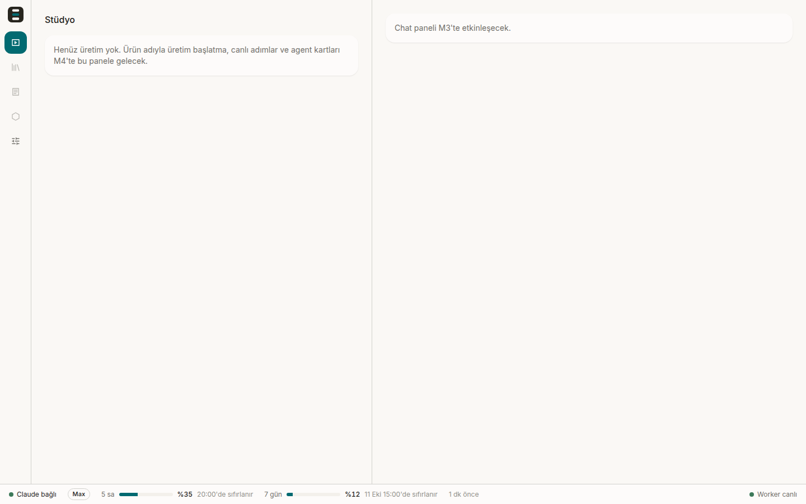
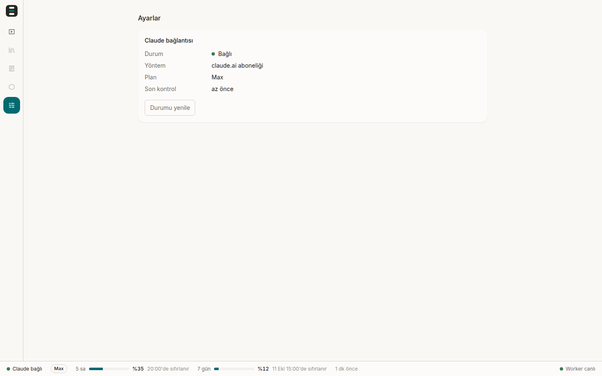

# M2 Platform İskeleti Raporu

| | |
|---|---|
| Tarih | 2026-10-06 |
| Dal | `m2-skeleton` (main `4402023`'ten; M0 birleşmiş hâli) |
| Durum | Tamamlandı. 9 görev + bu rapor. `npm run typecheck`, `npm test` (50/50) ve `npm run test:smoke` (3/3) geçti. Spec kararı değişmedi |
| Kanıt kaynakları | `.superpowers/sdd/2026-10-06-m2-skeleton/task-*-report.md`, `progress.md` (controller defteri), `tests/smoke/`, `docs/m2/*.png` |

Bu rapor, platform iskeletinin (Postgres + API + Worker + Arayüz kabuğu + tek komutla başlatıcı) neyi kanıtladığını ve nerede sınırlı kaldığını anlatır. M0 gerçekleri (`docs/m0/report.md`) iskeletin içine işlendi; özellikle kullanım birimleri.

## 1. Tamamlanan görevler

Her görev tek commit; düzeltme turları `--fixup` ile ilgili commit'e katlandı (autosquash sonrası ağaç aynı).

| Görev | Commit | Test | Notlar |
|---|---|---|---|
| T1 monorepo, config, ücretli anahtar muhafızı | `a9b4c2a` | shared 4 | Düzeltme turu: muhafız listesi genişletildi (bkz. §5) |
| T2 `@videogen/db`: şema, migration, audit zinciri | `6a51edd` | db audit 8 (plan 5) | Düzeltme turu: migration 0002 (kanonik biçim, `clock_timestamp`), normalize gizli anahtar regex'i |
| T3 `ui_events` outbox + NOTIFY + canlı kanal | `ab5a818` | db events 5 (plan 3) | Düzeltme turu: sıralama değişmezi belgelendi, `ts` monoton, prune ve çok baytlı testler |
| T4 Claude auth ve kullanım eşleyicileri | `15d1ffe` | shared usage 9 (plan 8) | M0 errata uygulandı; ek test T6'dan (`iso()` null koruması) |
| T5 API: localhost muhafızı, SSE replay, sistem uçları | `dfb0221` | api 12 (plan 5) | İki Important düzeltme turu (bkz. §5) |
| T6 Worker: auth durumu, `get_usage` yoklaması, heartbeat, komutlar | `506f225` | worker 6 (plan 3) | Gerçek gömülü CLI ile elle doğrulandı (zero token) |
| T7 Arayüz kabuğu (Perplexity temalı), SSE deposu, footer, Ayarlar | `e198c71` | web 6 (plan 0) | `frontend-design` cilası; ekran görüntüleri kontrol edildi |
| T8 `bin/videogen.mjs` (`npm start`) | `8757175` | (elle doğrulama, §4) | Ortak muhafız, mtime ile yeniden derleme, port yoklaması |
| T9 Playwright smoke S1 | `38f064b` | smoke 3 | Ardışık 3 koşu temiz, süreç/port artığı yok |
| T10 README + bu rapor | bu commit | tüm paket (§2) | |

## 2. Test sonuçları

Koşu: `npm run typecheck && npm test && npm run test:smoke`, hepsi çıkış kodu 0 (2026-10-06 05:32).

**`npm run typecheck`** (`tsc -p tsconfig.json`, TypeScript 7.0.2): çıktı yok, hata yok.

**`npm test`** (Vitest 5.0.3):
```
 Test Files  9 passed (9)
      Tests  50 passed (50)
   Duration  4.86s
```

| Paket / dosya | Test | Plan | Not |
|---|---|---|---|
| `packages/shared/test/paid-key-guard.test.ts` | 4 | 4 | Aynı sayı, iddialar genişledi |
| `packages/shared/test/usage.test.ts` | 9 | 8 | +1: ayrıştırılamayan tarih → null |
| `packages/db/test/audit.test.ts` | 8 | 5 | +3: kanonik çakışma, geriye tarihleme, gizli anahtar yazımları |
| `packages/db/test/events.test.ts` | 5 | 3 | +2: `pruneEvents`, çok baytlı `publishLive` |
| `apps/api/test/guard.test.ts` | 3 | 3 | |
| `apps/api/test/sse.test.ts` | 8 | 2 | +6: taze bağlantı, `after>max`, `?after=`, örtüşme, bozuk `vg_live`, kapatma |
| `apps/api/test/system.test.ts` | 1 | 0 | `/api/usage` yuvarlama |
| `apps/worker/test/account-usage.test.ts` | 6 | 3 | +3: `withTimeout`, komut dayanıklılığı, bağlantı kaybı |
| `apps/web/test/live.test.ts` | 6 | 0 | EventSource yeniden bağlanma, backoff, DB sıfırlanması, bozuk JSON |
| **Toplam** | **50** | 28 | 22 ek test, hepsi controller onaylı düzeltme turlarından |

**`npm run test:smoke`** (Playwright, `channel: 'chrome'`, port 5190, `videogen_smoke` veritabanı):
```
  ✓  1 s1-boot.spec.ts › S1: shell boots under 2 s and shows Claude connection, usage and worker liveness (865ms)
  ✓  2 s1-boot.spec.ts › S1: non-localhost Host is rejected on reads and on the event stream (20ms)
  ✓  3 s1-boot.spec.ts › S1: audit chain is valid after boot (14ms)
  3 passed (4.4s)
```
T9 sırasında 3 ardışık koşu da `3 passed` (4,7 ile 5,2 sn). Her koşudan sonra `apps/(api|worker)/src/main.ts` ve `smoke/stack.mjs` süreçleri ile 5190 dinleyicisi yok.

## 3. Ekran görüntüleri

Fixture değerleriyle alındı (gerçek hesap yüzdeleri değil: 5 sa %35, 7 gün %12).

| Stüdyo kabuğu | Ayarlar |
|---|---|
|  |  |

- Parşömen zemin `#faf8f5`, tek vurgu teal `#016a71` (yalnızca aktif menü ve ilerleme çubukları), yazı ağırlıkları 400/500.
- Footer: Claude bağlantı noktası, plan rozeti (Max), 5 sa ve 7 gün çubukları (yüzde + sıfırlanma), son güncelleme yaşı, worker canlılığı.
- Kütüphane, Audit ve Varlıklar menü girdileri soluk ve devre dışı.

## 4. `npm start` doğrulama çıktıları (T8)

Claude auth/usage fixture ile, `VG_NO_BROWSER=1`.

| Kontrol | Sonuç |
|---|---|
| Sağlık | `GET /api/health` → `{"ok":true}`; `GET /` SPA `index.html` |
| Host koruması | `curl -H 'Host: evil.example' …` → **403** |
| Audit zinciri | `GET /api/audit/verify` → `{"ok":true,"checked":10,"firstBadSeq":null}` |
| Ücretli anahtar | `ANTHROPIC_API_KEY=x npm start` → `[videogen] Ücretli API anahtarı bulundu, başlatma reddedildi: ANTHROPIC_API_KEY`, çıkış 1 |
| Ortak liste kanıtı | `MISTRAL_API_KEY=x npm start` → aynı mesaj `MISTRAL_API_KEY` ile, çıkış 1 (MISTRAL yalnızca genişletilmiş ortak listede; başlatıcının kendi kopyası yok). Reddetme mkdir/docker'dan önce; `~/videogen-data` oluşmadı |
| Gözetim | `kill -9 <worker>` → `worker çıktı (code=null signal=SIGKILL); 1 sn sonra yeniden başlatılıyor`, yeni PID, audit 10→11 (`worker.started`). 10 sn içinde ikinci kesinti → 2 sn bekleme (backoff yükseldi) |
| Durdurma | `kill -INT <başlatıcı>` → 0,4 sn'de çıkış; artık süreç yok, 5180 boş |
| Bayat derleme | `apps/web/src` altında dosya `touch` → `vite build` çalıştı (243 ms), ardından API sağlıklı |
| Port dolu | 5180 doluyken ikinci `node bin/videogen.mjs` → `[videogen] 127.0.0.1:5180 dolu (başka bir VideoGen çalışıyor olabilir)`, çıkış 1; ilk örnek sağlıklı, tek API + tek worker |
| Sürekli çöken çocuk | 100 KB stdout/stderr yazıp çıkan sahte API: 3 yeniden başlatma, bekleme 2/4/8 sn, `api.log` 600.006 bayt eksiksiz, `ERR_STREAM_WRITE_AFTER_END` yok |
| `xdg-open` yok | `[videogen] tarayıcı açılamadı, adresi elle açın: http://127.0.0.1:5180`, başlatıcı çalışmaya devam etti |
| `docker` yok | `başarısız: docker compose up -d --wait postgres (spawnSync docker ENOENT)` + ipucu, çıkış 1 |

Gerçek gömülü CLI ile (T6): `auth status` → `loggedIn: true, claude.ai, max`; bir `get_usage` çağrısı 1,8 sn, sıfır tur/token, 5 sa 0,75 / 7 gün 0,18 (0..1 normalize).

## 5. Plandan sapmalar

Biçim: görev · ne · neden. Hiçbiri spec kararını (§4 K-tablosu, mimari) değiştirmedi.

**Kullanım birimleri ve ücretli anahtar muhafızı**
- T4 · Planın başındaki **M0 errata** uygulandı: `get_usage` yüzde 0..100 + ISO, `rate_limit_event` kesir 0..1 + epoch sn; eşleyici kaynağa göre normalize ediyor, büyüklüğe göre tahmin yok · Aksi hâlde %1 değeri %100 görünürdü (M0 §6).
- T1 · Ücretli anahtar listesi **genişletildi**: sağlayıcı önekli desen (MISTRAL, COHERE, GROQ, XAI, DEEPSEEK, OPENROUTER, TOGETHER, ELEVEN/XI, GOOGLE_AI, AZURE_OPENAI, REPLICATE, STABILITY, RUNWAYML, FAL…), `AWS_BEARER_TOKEN_BEDROCK`, `ANTHROPIC_FOUNDRY_API_KEY`, `CLAUDE_CODE_USE_BEDROCK/VERTEX/FOUNDRY` · Spec §6.6 "bilinen ücretli anahtar desenleri" der; yalnızca tam adlar kaçırıyordu. Genel `_API_KEY$` yok (yanlış pozitif başlatmayı engellerdi); kullanıcı ortamındaki `CLAUDE_CODE_MESSAGING_TOKEN` eşleşmiyor (testli).
- T8 · Başlatıcı muhafız listesini **kopyalamıyor**: `tsx/esm/api` ile `@videogen/shared`'dan `findPaidKeys` içe aktarıyor · Planın elle kopyası kaymıştı; tek doğruluk kaynağı. Smoke yığını da `cleanChildEnv` kullanıyor (T9).

**Audit zinciri**
- T2 · Migration `0002_audit_canonical`: kanonik metin `'|'` birleştirmesi yerine `jsonb_build_array(...)::text` · `'a|b','c'` ile `'a','b|c'` aynı metni üretiyordu; alan sınırları belirsiz olduğu için kurcalama tespit edilemezdi (spec §11.2 plan SQL'inden önce gelir). Ana DB'de 0 satır vardı, kayıp yok.
- T2 · Zincir tetikleyicisi `ts := clock_timestamp()` · İstemci geriye tarihli `ts` veremesin.
- T2 · `findSecretKeys` anahtarı normalize ediyor (küçük harf, alfasayısal olmayanlar silinir) ve `(token|secret|password|passwd|apikey|authorization|cookie|privatekey)$` ile eşliyor · `accessToken`, `Set-Cookie`, `API_KEY` gibi yazımlar sabit listeyi atlatıyordu.
- T2 · Test yardımcısı migration başarısız olursa test DB'sini siliyor · Sızıntı önleme.

**Olay hattı (SSE)**
- T3 · `ui_events` sıralama değişmezi: DB tablo yorumu + modül başlığı "tüm yazmalar `publishEvent`'ten geçer"; INSERT `clock_timestamp()` kullanır (kilit alındıktan sonra) · `ts` id ile monoton olsun. DB'de zorlama M3'e ertelendi (bkz. §7).
- T5 · **Taze SSE bağlantısı (Last-Event-ID / `?after=` yok) o anki max id'den başlar**, tüm geçmişi tekrar oynatmaz; `after>max` sıfırlama sayılır, max'tan başlar · Spec §12.4 yalnızca kopma sonrası replay ister; tam geçmiş M3'te sınırsız büyürdü.
- T7 · Bunun karşılığı: **istemci EventSource her `open`'da REST'i yeniden çeker** (`['claude']`, `['usage']`) · Bağlantı yokken kaçan olaylar kapanır.
- T5 · `Fastify({ forceCloseConnections: true })` · Açık SSE akışı varken `app.close()` asılıyordu (test: < 1,5 sn).
- T5 · **Sıkı Host regex'i** `^(\[::1\]|127\.0\.0\.1|localhost)(:\d{1,5})?$` · `localhost:evil.example`, boş ve 6 haneli port geçiyordu.
- T5 · SSE `close` işleyicisi replay'den önce kaydedilir, replay hatası yakalanır; hub yeniden bağlanma zamanlayıcısı `stop()`'ta temizlenir; bozuk `vg_live` yükü günlüğe yazılıp atılır; pump hataları günlüğe yazılır · Abonelik/zamanlayıcı sızıntısı ve çökme.
- T5 · `/api/usage` değerleri 4 ondalığa yuvarlanır (`float4` gürültüsü) · Gösterim.
- T7 · `connectLive` CLOSED durumunda (200 olmayan yanıt, ör. Vite proxy 5xx) yeniden oluşturulur: 1→2→4→8→10 sn tavan, `?after=<alınan>`; DB sıfırlanırsa (gelen id ≤ alınan) izleme noktası geri çekilir · Plan yalnızca tarayıcının otomatik yeniden denemesine güveniyordu; CLOSED sonsuza dek bannerda kalırdı.

**Worker**
- T6 · Worker **yalnızca çökerek** kurtarılır: LISTEN bağlantısı kopunca stderr'e tek satır + `exit(1)`, yeniden başlatmayı başlatıcı yapar · Süreç içi yeniden bağlanmaya göre daha basit ve doğru (spec §5.1 gözetim).
- T6 · Zaman aşımları: `get_usage` çağrısı 30 sn (`withTimeout`, `q.close()` + `release()`); `drain` yakalanmamış reddi yok · Takılan deneysel API yoklayıcıyı kilitlemesin.
- T6 · `vg_commands` NOTIFY yükü dayanıklı: bozuk JSON, bilinmeyen tür, `constructor` gibi prototip adları, fırlatan işleyici → `command.failed` audit satırı, worker ayakta · Bozuk yük worker'ı çökertiyordu.
- T6 · `CliAuthStatus` hata metni sabit (`auth status failed (exit N)`); CLI stdout parçası yansıtılmaz · Kimlik bilgisi sızıntısı riski.
- T6 · `iso()` ayrıştırılamayan tarihte `RangeError` yerine `null` · `get_usage` deneysel; tek bozuk alan anlık görüntüyü öldürmesin.
- T6 · Hata audit'leri yalnızca `class[:code]` etiketi taşır (ham mesaj değil); başlangıç hatası yalnızca sınıf adı yazar · Mesajlar bağlantı dizesi içerebilir.
- T6 · Plandaki `npx tsx -e` komutu `.mts` betiği olarak çalıştırıldı · `tsx -e` CJS derler, top-level await yok.

**Başlatıcı (T8)**
- T8 · **Mtime ile yeniden derleme**: `apps/web/dist/index.html`, `apps/web/src` veya `index.html`'den eskiyse `vite build` · Plan yalnızca dist yoksa derliyordu; bayat SPA sessizce çalışırdı.
- T8 · **Port yoklaması**: anahtar muhafızından hemen sonra 5180 `listen` denemesi; doluysa Türkçe mesaj + çıkış 1; sağlık beklemesi API çocuğu çıkmışsa hemen başarısız · Yabancı bir süreç varken yalancı "hazır" ve ikinci worker.
- T8 · Gözetim sertleştirme: yeniden başlatma zamanlayıcıları izlenip temizlenir; sinyal işleyicileri çocuklardan önce kurulur; log akışı `close` olayında kapanır (yazma-sonrası-bitiş çökmesi yok); `xdg-open` ve docker hataları teşhis mesajı verir; `process.on('exit')` kalan çocukları SIGKILL'ler · Plan bunları içermiyordu.

**Arayüz (T7)**
- T7 · Ayarlar yoklaması 5 sn yerine **15 sn**; yalnızca sekme görünür + durum sorgusu başarılı + `loggedIn === false` iken ve uçuştaki istek koruması ile · Plan oturum açılmamışken saatte 720 audit satırı ve CLI süreci üretirdi (worker zaten 60 sn'de bir yeniler).
- T7 · Footer saati 1 sn'de bir; "Claude durumu alınıyor/alınamadı" ve "Worker kontrol ediliyor" ara durumları · İlk heartbeat öncesi 0–2 sn yanlış alarm.
- T7 · Claude "bağlı" noktası teal yerine yeşil · Teal yalnızca aktif menü ve ilerleme çubukları kuralı.
- T7 · `apps/web/src/vite-env.d.ts` eklendi (`/// <reference types="vite/client" />`) · TS 7 `noUncheckedSideEffectImports` CSS içe aktarmasında TS2882 veriyordu.
- T7 · `vite.config.ts` `/events` proxy'si `configure` kancalı nesne biçiminde · Vite upstream kapanışını tarayıcıya iletmiyordu (yalnızca dev).
- T7 · Geliştirme doğrulaması `npm run dev:*` yerine `node --import tsx …` ile başlatıldı · `npm → tsx watch → node` zinciri tek PID ile güvenle öldürülemiyor (`pkill -f` yasak).

**Smoke (T9)**
- T9 · `webServer` komutu `node --import tsx stack.mjs` (planda `node tests/smoke/stack.mjs`) · Playwright cwd'yi config klasörü yapar (yol iki kez eklendi); `--import tsx` ortak muhafız için gerekli.
- T9 · Yığın env'i `cleanChildEnv(process.env)` ile kurulur · Kullanıcı ortamındaki ücretli anahtar benzeri değişken api/worker'ı reddettirir ve smoke'u düşürürdü.

**Test sayısı değişiklikleri (plan → son):** paid-key-guard 4 → 4, usage 8 → 9, audit 5 → 8, events 3 → 5, api 5 → 12 (guard 3 + sse 8 + system 1), worker 3 → 6, web 0 → 6, smoke 3 → 3. Plan toplamı 28 vitest testi → **50** (controller onaylı; her biri bir düzeltme bulgusuna bağlı).

**Süreç notları**
- Düzeltme turları `--fixup` ile açıldı ve autosquash ile tek commit/görev yapıldı (ağaç özdeş).
- Her görevin incelemesi bir sonraki görevin uygulamasıyla eşzamanlı yürüdü (uygulayıcılar sıralı kaldı); duvar saati ~%40 kısaldı.

## 6. Bilinen sınırlar

- **Kütüphane, Audit ve Varlıklar** menü girdileri devre dışı (görünür, tıklanamaz). Stüdyo ve sohbet panelleri yer tutucu (M3/M4).
- **Footer kaynağı `get_usage`** (M0 (b) kararı); `rate_limit_event` yedek olarak M3'te canlı turlar başlayınca bağlanacak. `get_usage` deneysel API: SDK yükseltmesinde ad/şekil değişirse footer "—" gösterir; SDK sürümü tam sabitli.
- **Claude girişi v1'de terminalden:** Ayarlar `! claude auth login` talimatını gösterir ve girişi 15 sn'de bir yoklar (M0 (c) kararı).
- **Günlükler dönmez** (`~/videogen-data/logs`, ekleme kipinde büyür; M7). Başlatıcı `close` olayını torun süreçlerin tuttuğu stdio'ya kadar bekler: gelecekteki ffmpeg gibi çocuklar stdio'yu miras almamalı.
- **Worker `vg_live` bağlantı kaybında yeniden başlar** (crash-only); kısa bir kesinti (≤ backoff) gözlenir.
- **SSE sessiz ama açık akış** (yarı açık TCP) algılanmaz; adlandırılmış API heartbeat olayı yok. Worker bu durumda "canlı" gösterebilir.
- **Audit:** SQL NULL `data` ile JSON `null` aynı kanonik metni verir (`appendAudit` JSON null yazmaz). Zincir anahtarsız SHA-256 ve tablo sahibi süper kullanıcı: kurcalama tespit edilir, önlenmez.
- **Gizli anahtar regex'i** `*_key` sonekli (`secret_key`, `access_key`, `signing_key`) ve çoğul (`cookies`, `secrets`, `credentials`) biçimleri kaçırır.
- **Smoke:** yığın `dist` yoksa derler (bayat dist eski kodu test eder); migrate/build çıkış kodları denetlenmez (hata 120 sn zaman aşımı olarak görünür); 3 sn'lik çıkış yedeği çocuklara SIGKILL atmaz; audit testi test 1'in sırasına bağlı; her koşu `/tmp/videogen-smoke-*` bırakır ve `videogen_smoke` DB'si kalır.
- **Eksik testler:** `main.ts` başlangıç/kapanış kablolaması ve gerçek CLI ile `q.close()`/zaman aşımı yolu otomatik testle kapsanmıyor; başlatıcı elle doğrulandı (§4).
- Web `tsconfig` `types` ayarı ve devre dışı menü bağlantılarının klavye odağı alması cila maddesi; Ayarlar "Son kontrol" yaşı yeniden çizilmiyor.
- Küçükler: `VG_PORT` NaN/0 doğrulanmıyor; `ANTHROPIC_BASE_URL` çocuk env'inden silinmiyor; `findBundledClaude` ilk çalıştırılabiliri seçiyor; boş `?after=` / `Last-Event-ID` 0 sayılıp tam replay yapar; `forceCloseConnections` kapanışta uçuştaki istekleri keser (yerel kullanımda kabul edildi).
- Repo kökündeki `.env` (önceden var, kullanıcıya ait, gitignore'da, hiç commit edilmedi) TikTok sandbox anahtarları içeriyor; bir inceleme aracı değeri kendi bağlamında gördü. Eylem gerekmiyor, bilgin olsun.

## 7. M3'e devredilenler

| Madde | Neden M3'te |
|---|---|
| `ui_events` sıralamasını **veritabanında zorlamak** (SECURITY DEFINER yayın fonksiyonu + `REVOKE INSERT`) | Şimdiki tek yazar API/Worker'ın `publishEvent`'i; ikinci bir yazar süreç gelince değişmez korunmalı. `BEFORE INSERT` tetikleyicisi çözmez: `nextval` varsayılanı tetikleyiciden önce değerlendirilir |
| **Adlandırılmış API heartbeat olayı** + istemci izleme köpeği | Yarı açık SSE akışı algılanır; Worker "canlı" yanlış göstermez |
| Arayüz **flush üst sınırı** (~10 Hz) | rAF ~60 Hz; M3'te trace olay hacmi artar |
| Gizli anahtar regex'ine `*_key` sonekleri ve çoğullar | Agent araç girdileri audit'e yazılınca ilgili hâle gelir |
| **Harici audit baş doğrulaması** (zincir başının dışarıda çıpalanması) | Süper kullanıcı sahibi zinciri baştan yazabilir; M7 (yedek/dayanıklılık) |
| `findBundledClaude`'u `claude` adına sabitlemek | Bugün tek çalıştırılabilir var; SDK paketi ek ikili eklerse yanlış seçilir |
| `CliAuthStatus`'ın sıfır olmayan çıkışta `stdout` ayrıştırması | `auth status` çıkış 1 iken de JSON verebilir |
| `listenCommands`/heartbeat/`main.ts` kablolaması için test | M3'te Worker yük kazanınca |
| Smoke yığın sertliği (stale dist, çıkış kodları, SIGKILL yedeği) ve günlük dönmesi | Smoke M3'te genişleyince; dönme M7 |
| M3'te ayrıca (M0'dan): son `result`'a göre kullanım muhasebesi, iptal hatasını yakalama, `task_progress`'e dayanmama, Bash/NotebookEdit `PreToolUse` kapsamı | `docs/m0/report.md` §12 |

Sıradaki: **M1 dinleme testi** (ses servisi ve TTS kararı), ardından M3.

## 8. Kullanım

M2 orkestrasyonu sırasında Max aboneliğinin **5 saatlik penceresi ~%75'e** ulaştı (T6'daki gerçek `get_usage` çağrısı: 0,75; 7 günlük %18). Orkestrasyon oturumu ve alt ajanlar aynı abonelik havuzunu paylaşıyor; pencere M0'daki %58–62'den yükseldi. Uygulayıcı ve inceleyici alt ajanları paralel çalıştığı için görev başına ayrıştırılamıyor. M3'ten önce pencerenin sıfırlanmasını beklemek ya da M1'i (Claude'suz) araya almak makul. Ürün kodunun kendisi (Worker'ın `get_usage` yoklaması) sıfır token harcar.
